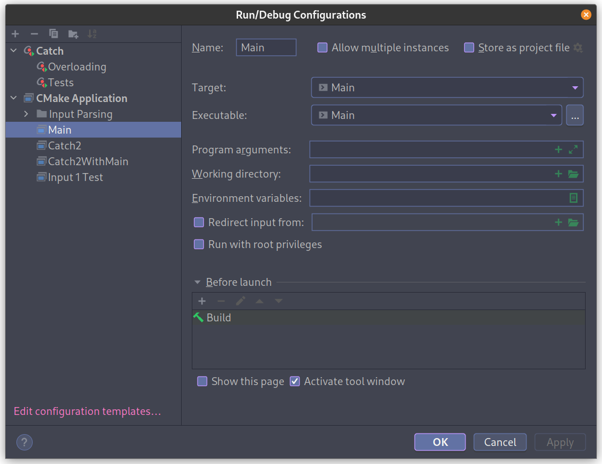
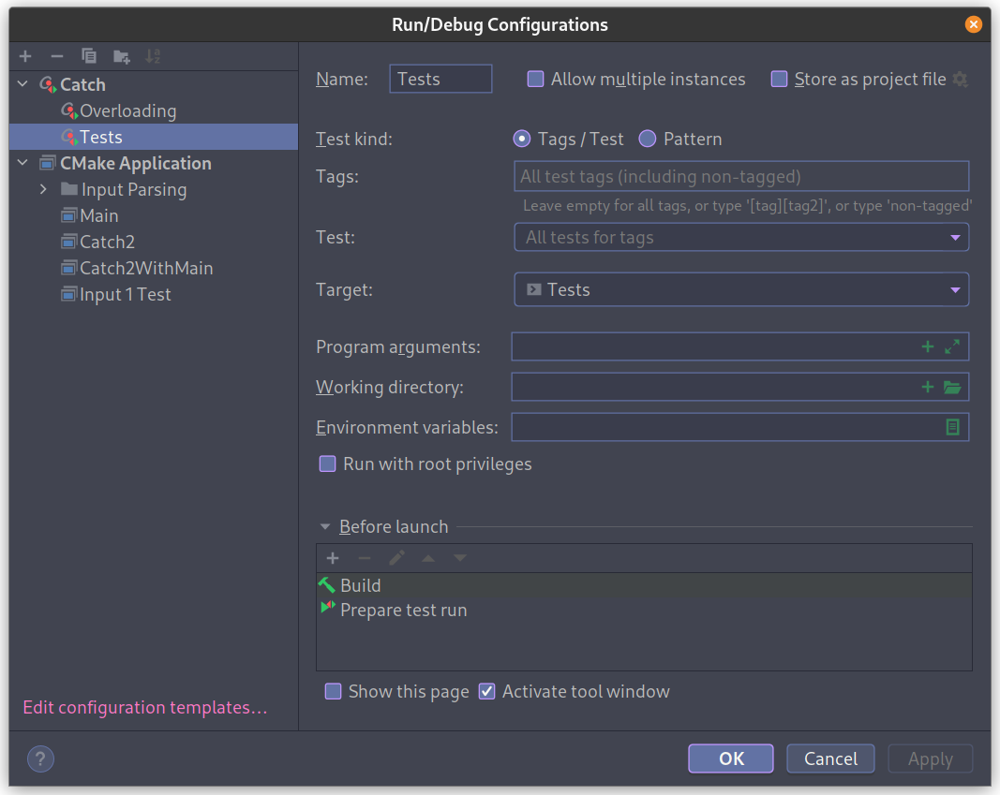
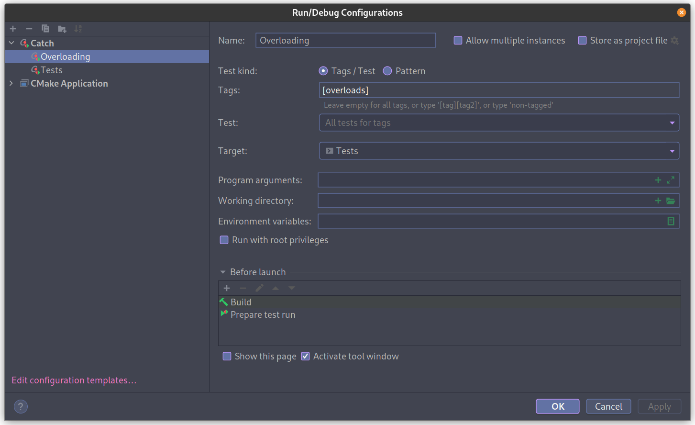
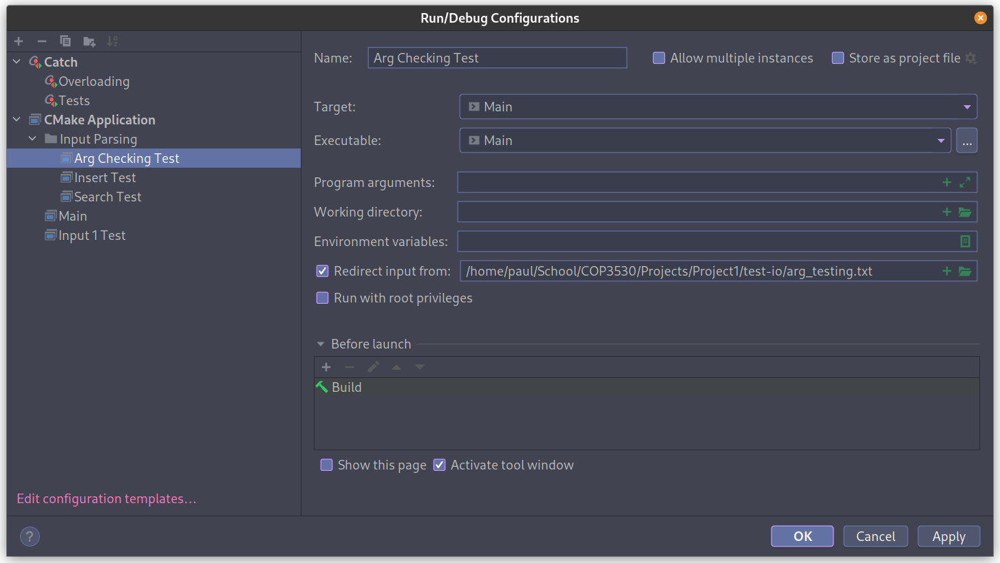

This is a guide to use catch with cmake instead of the header file approach provided by Edugator. It was originally written for use with the University of Florida's COP3530 class but should work regargdless.

# Table of Contents

1.  [Part 1: Why Bother?](#org5e1347a)
2.  [Part 2: Setting up cmake](#orgf5c7f84)
3.  [Part 3: Integrating with clion](#org390eeee)


**Note that I use clion, so this guide will only talk about integrating it there - the cmake steps should be the same, but I&rsquo;m not sure how cmake integrates with VSCode - if anyone could share under this post, that would be helpful!**


<a id="org5e1347a"></a>

# Part 1: Why Bother?

Using the included catch file works fine, but each time you change test.cpp, it recompiles the entire catch header, making it take quite a while. Additionally, the catch.hpp provided on the project template is old and doesn&rsquo;t actually compile on Linux without adding the line `#define CATCH_CONFIG_NO_POSIX_SIGNALS` (<https://github.com/catchorg/Catch2/issues/2421>).

By instead using catch&rsquo;s newer cmake integration, it builds way quicker, lets you have a separate unit testing executable and main executable, and gives you access to the latest features of catch should you need them.


<a id="orgf5c7f84"></a>

# Part 2: Setting up cmake
This is mostly the same as from the video tutorial on each programming quiz (if you&rsquo;re using clion): navigate to test.cpp, click create a CMakeLists.txt, and accept the options to get a default file. From there, you need to add a couple lines to first pull in catch2 as a dependency and then link it to your compiled Tests executable. It&rsquo;s easier to show than to tell, so I&rsquo;ve attached a commented [CMakeLists.txt](./CMakeLists.txt) to explain.


# Part 2.5: Changing the include in test.cpp
I forgot to include this when originally writing the guide, but it's an important step. First, make sure you don't have your `main.cpp` included in `test.cpp`. Additionally, you need to replace the original `#include "catch.h"` with `#include <catch2/catch_test_macros.hpp>` for it to actually use the cmake-based catch.
The top of my test.cpp looks like this:
```c++
#define CATCH_CONFIG_MAIN

#include <catch2/catch_test_macros.hpp>
#include <iostream>
#include "../src/AVL.h"
#include "../src/Parser.h"
#include "../src/StudentNode.h"
```

Keep in mind that you should include your own header files.


<a id="org390eeee"></a>

# Part 3: Integrating with clion

I think Clion should do this automatically, but just in case, here&rsquo;s some screenshots of the different setups for the main executable and the unit test executable.





Once the two default builds are set up, I find it easiest to test specific things by duplicating the base configurations and changing flags. For example, to test the `[overloads]` catch flag only:


You can also pass in certain files as stdin so you don&rsquo;t have to type test inputs manually:

Note that this can be done with the provided files as well as custom ones you write.

# Part 4: Using it
At this point, everything should work! You can just pick your run configuration in the menu at the top, and it'll compile and run your main or Tests or any of your debug configurations.

I hope this helps!
